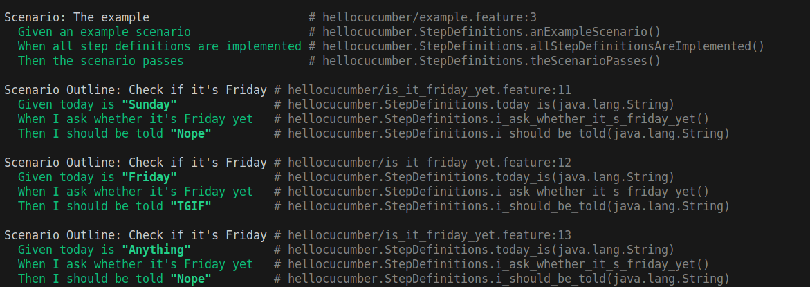
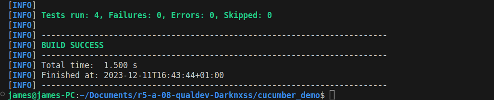
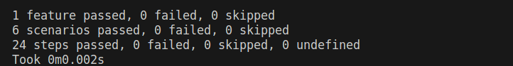
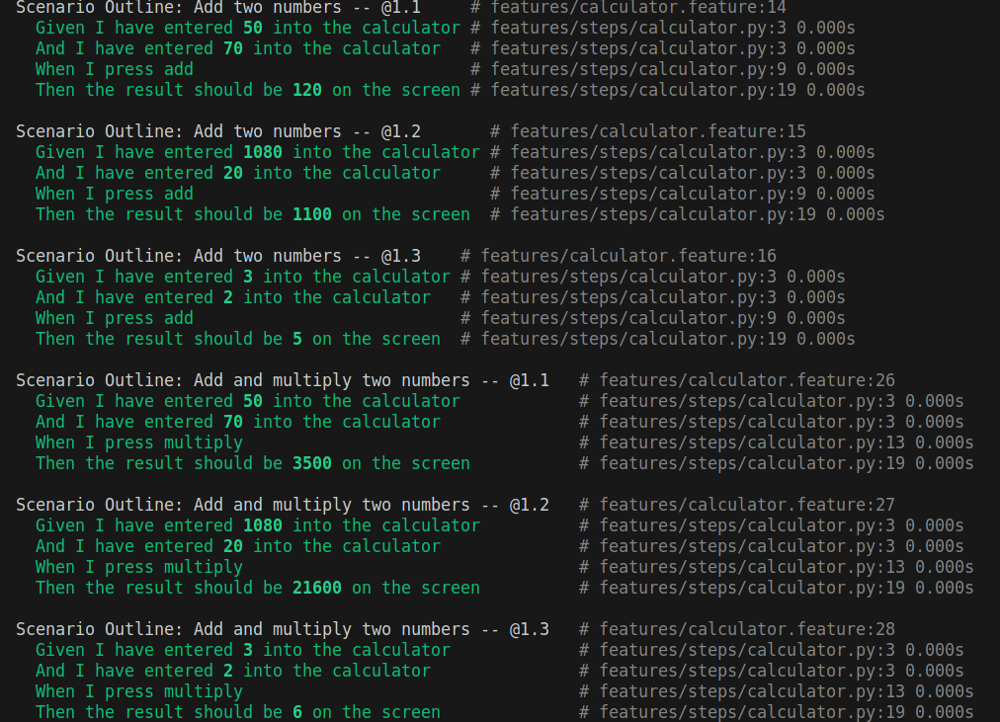

[](https://classroom.github.com/online_ide?assignment_repo_id=13208727&assignment_repo_type=AssignmentRepo)
= R5.A.08 -- Dépôt pour les TPs
:icons: font
:MoSCoW: https://fr.wikipedia.org/wiki/M%C3%A9thode_MoSCoW[MoSCoW]

Ce dépôt concerne les rendus de mailto:A_changer@etu.univ-tlse2.fr[Jonh Doe].

== TP1

.Contenu du fichier is_it_friday_yet.feature
```
Feature: Is it Friday yet?
  Everybody wants to know when it's Friday

  Scenario Outline: Check if it's Friday
    Given today is "<day>"
    When I ask whether it's Friday yet
    Then I should be told "<answer>"

  Examples:
    | day            | answer |
    | Sunday         | Nope   |
    | Friday         | TGIF   |
    | Anything else  | Nope   |
```

.Execution avec succès des tests


== TP2...

.Contenu du fichier Order.java
[source, java]
----
package dojo;

import java.util.ArrayList;
import java.util.List;
import static org.junit.Assert.assertEquals;

public class Order {
    private String owner;
    private String target;
    private String message;
    private List<String> cocktails;

    public Order() {
        this.cocktails = new ArrayList<>();
    }

    public void declareOwner(String owner) {
        this.owner = owner;
    }

    public void declareTarget(String target) {
        this.target = target;
    }

    public void declareMessage(String message) {
        this.message = message;
    }


    public List<String> getCocktails() {
        return cocktails;
    }

    public void addCocktail(String cocktail) {
        this.cocktails.add(cocktail);
    }
}
----

.Execution avec succès des tests



== TP3...

L'objectif fixé est de reproduire le comportement d'un utilisateur avec une calculatrice et de tester quand on additionne et multiplie 2 nombres

.Contenu du fichier calculator.py
[source, python]
----
from behave import given, when, then

@given('I have entered {number} into the calculator')
def step_impl(context, number):
    if not hasattr(context, 'numbers'):
        context.numbers = []
    context.numbers.append(int(number))

@when('I press add')
def step_impl(context):
    context.result = sum(context.numbers)

@when('I press multiply')
def step_impl(context):
    context.result = 1  
    for num in context.numbers:
        context.result *= num

@then('the result should be {expected_result} on the screen')
def step_impl(context, expected_result):
    assert context.result == int(expected_result)
----


.Contenu du fichier calculator.py
[source, gherkin]
----
Feature: Calculator
    In order to avoid silly mistakes
    As a math idiot
    I want to be told the sum and the multiplication of two numbers

Scenario Outline: Add two numbers
    Given I have entered <number1> into the calculator
    And I have entered <number2> into the calculator
    When I press add
    Then the result should be <resultAdd> on the screen

Scenario Outline: Multiply two numbers
    Given I have entered <number1> into the calculator
    And I have entered <number2> into the calculator
    When I press multiply
    Then the result should be <resultMultiply> on the screen

Examples:
    | number1 | number2 | resultAdd | resultMultiply |
    | 50      | 70      | 120       | 3500           |
    | 1080    | 20      | 1100      | 21600          |
    | 3       | 2       | 5         | 6              |
----

.Execution avec succès des tests


.Trace d'execution de tests


== TP4

L'objectif fixé pour ce TP est de générer une documentation pour les tests.

La documentation du TP2 a donc été générée avec cukedoctor.
La documentation est disponible dans le dossier doc. 

link:cucumber_demo/doc/cucumber-html-reports/overview-features.html[La documentation est disponible en cliquant ici.]

.Contenu du fichier RunCucumberTest.java (TP2)
[source, java]
----
package dojo;

import cucumber.api.junit.Cucumber;
import org.junit.runner.RunWith;
import cucumber.api.CucumberOptions;
import net.masterthought.cucumber.Configuration;
import net.masterthought.cucumber.ReportBuilder;
import org.junit.AfterClass;

import java.io.File;
import java.util.ArrayList;
import java.util.List;

@RunWith(Cucumber.class)
@CucumberOptions(plugin = {"json:target/cucumber.json"} )
public class RunCucumberTest { 
    @AfterClass
    public static void generateReport() {
        File reportOutputDirectory = new File("doc");
        List<String> jsonFiles = new ArrayList<>();
        jsonFiles.add("target/cucumber.json");

        String buildNumber = "1";
        String projectName = "CucumberProject";
        Configuration configuration = new Configuration(reportOutputDirectory, projectName);
        configuration.setBuildNumber(buildNumber);
        configuration.addClassifications("Platform", "Windows");
        configuration.addClassifications("Browser", "Chrome");
        configuration.addClassifications("Branch", "release/1.0");

        ReportBuilder reportBuilder = new ReportBuilder(jsonFiles, configuration);
        reportBuilder.generateReports();
    }
}

----

